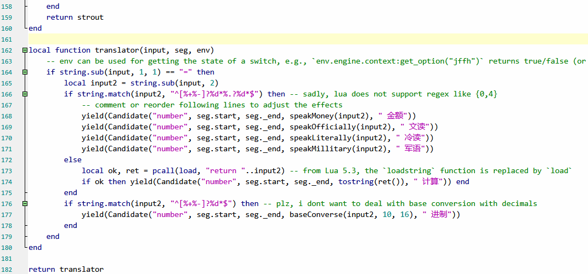

# 项目介绍

收集一些自制或修改的RIME lua脚本。目前包含以下脚本：

## xnumber.lua

功能：实现仿小小输入法的特殊输入模式。用`=`触发。

用法：

1. 把脚本放到 `rime\lua`。
2. 修改 `rime\rime.lua` ，添加一行： `number_translator = require("numberx")`
3. 修改方案文件（如 `xkjd6.schema.yaml`），在`engine/translators`下面添加一项： `- lua_translator@number_translator` 
4. 重新部署。

预览：

相关项目：[RIME键道输入法](https://gitee.com/xkinput/Rime_JD)
